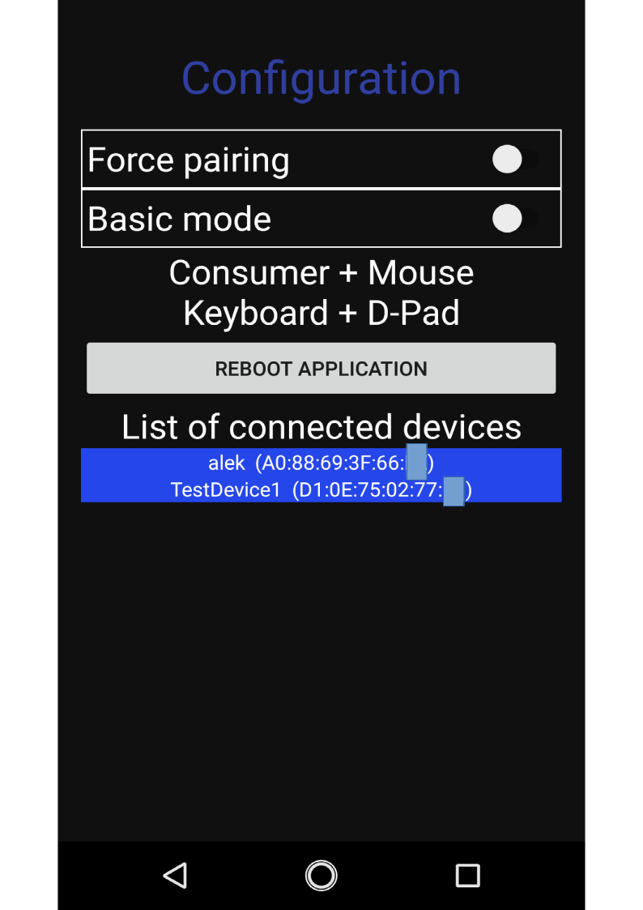
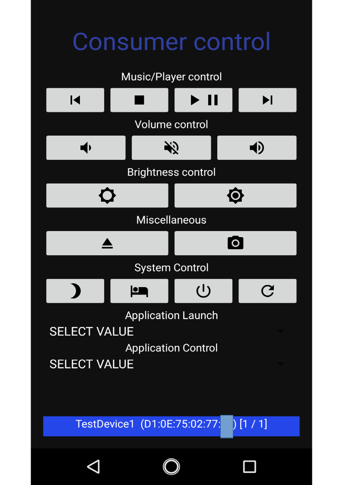
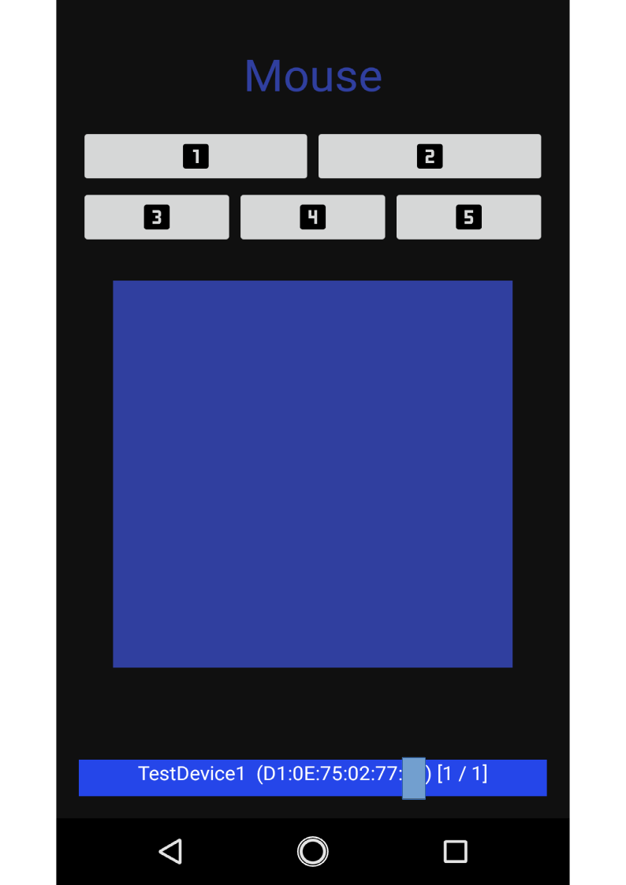
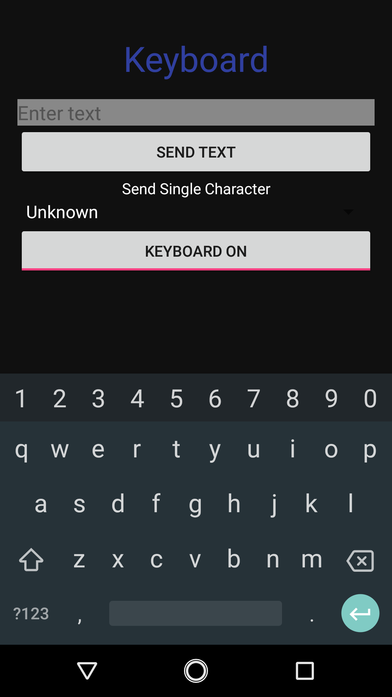
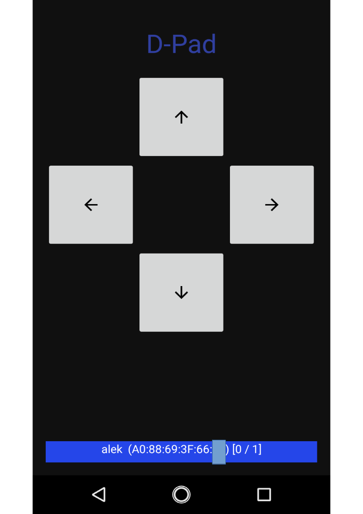

# BLE_HID_EXAMPLE
Example of HID over GATT (Bluetooth Low Energy) Android Application. Application emulates the peripheral, server BLE device like mouse or keyboard, which could be connected by some central device like PC or smartphone.
It is working in 2 modes: basic - which could be handled by various operating systems and advanced - which communicates with Linux based and Android operating systems only.
Application is made of 2 (basic mode) or 5 (advance mode) full screen fragments.
When more than one device is connected to the application then the same notifications are sent to the all devices.

## Configuration fragment

- Force pairing switch - if enabled the device tries to start pairing with remote device, usable when the central doesn't start the pairing.
- Basic mode switch - if enabled only consumer control feature is supported by application, otherwise consumer control, mouse, keyboard and the D-Pad
- Reboot application button - it is recommended to reboot the application after switching the mode
- List of currently connected devices - device name and its address is shown

## Consumer control fragment

- Music/player control buttons - previous track, stop playing, play/pause, next track
- Volume control buttons - decrease volume, mute, increase volume
- Brightness control buttons - decrease brightness, increase brightness
- Miscellaneous buttons - eject (e.g. CD/DVD), take a snapshot
- System control buttons (advance mode only) - perform: hibernation, sleep. shut down, restart
- Application launch spinner (advance mode only) - start selected application e.g. calculator or WEB browser
- Application control spinner (advance mode only) - perform selected action on currently focused application e.g. show help

## Mouse fragment (advance mode only)

- Buttons (1, 2, 3, 4, 5) - emulates mouse's buttons click
- Touchpad area - move cursor, double click emulates a click by first (left) mouse button
- Device's volume up and volume down button - emulates the scroll wheel

## Keyboard fragment (advance mode only)

- Send phrase text view & 'send text button' - written text will be sent after clicking the button
- Send single character spinner - selected character will be sent
- Keyboard On/Off button - enables/disables the software keyboard, on each click selected character will be sent immediately

## D-Pad fragment (advance mode only)

- Arrow button - send up/down/left/right arrow character
